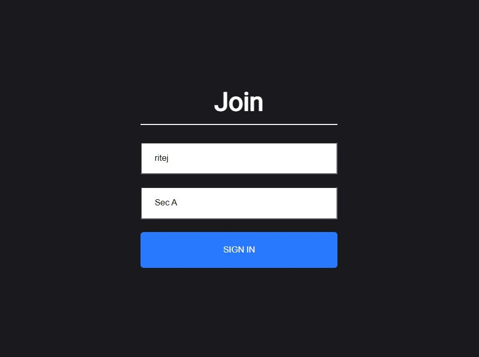
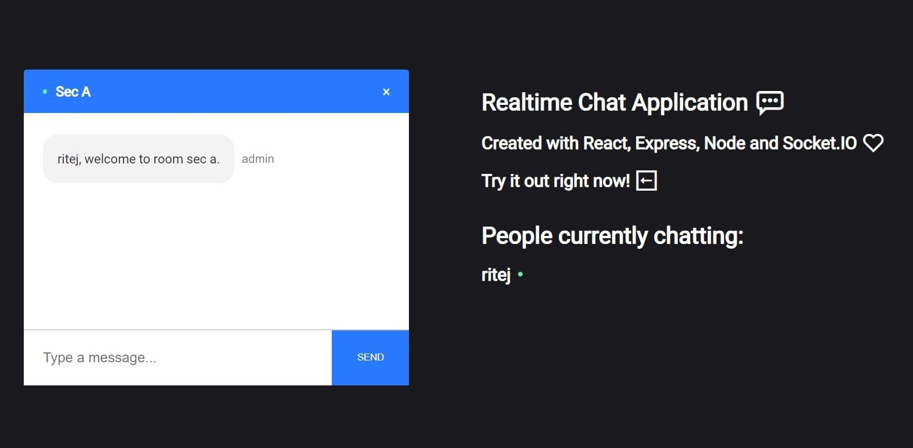

# Real-Chat
A realtime chat application built with MERN stack and socket.io.

## Live Demo
https://realtime-chat-application.netlify.com

## Features
Users can create a room and chat with one another




## Tech
- ReactJS
- NodeJS
- Express
- MongoDB
- Socket.io

## Setup and Installation
Clone the repository to your local machine.

In server directory: 
- Install required modules

  ``` npm install ```
  
- Run server in localhost

  ``` npm start ```

In client directory

- Install required modules

  ``` npm install ```
  
- Launch application in localhost

  ``` npm start ```
